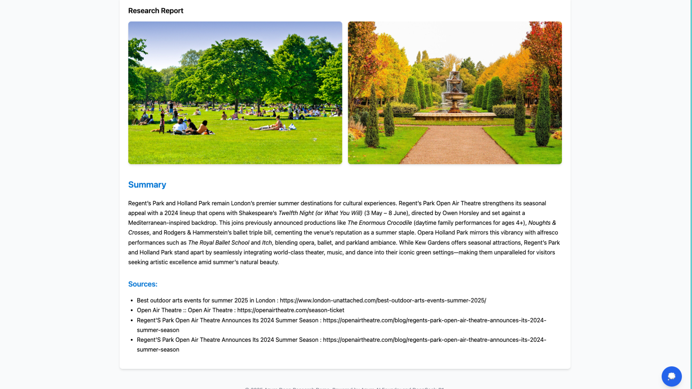

<!-- YAML front-matter schema: https://review.learn.microsoft.com/en-us/help/contribute/samples/process/onboarding?branch=main#supported-metadata-fields-for-readmemd -->

# Azure Deep Research: Reasoning Research Assistant

[](https://codespaces.new/Azure-Samples/deepresearch) [](https://vscode.dev/redirect?url=vscode://ms-vscode-remote.remote-containers/cloneInVolume?url=https://github.com/azure-samples/deepresearch) 


This sample creates a reasoning, AI-powered reseacrher using [DeepSeek R1](https://learn.microsoft.com/en-us/azure/ai-foundry/model-inference/concepts/models#deepseek). Give it a topic and it will generate a web search query, gather web search results, summarise the results of web search, reflect on the summary to examine knowledge gaps, generate a new search query to address the gaps, search, and improve the summary for a user-defined number of cycles. It will provide the user a final markdown summary with all sources used. The sample uses [langchain-azure-ai](https://github.com/langchain-ai/langchain-azure), which allows us to access the [Azure AI Inference API](https://learn.microsoft.com/en-us/azure/ai-foundry/model-inference/overview) to use DeepSeek R1. [LangGraph](https://langchain-ai.github.io/langgraph/), Langchain's framework for building AI agents, is used to implement the reflection architecture. 

## Table of Contents

- [Features](#features)
- [Azure Account Requirements](#azure-account-requirements)
- [Getting Started](#getting-started)
    - [GitHub Codespaces](#github-codespaces)
    - [VS Code Dev Containers](#vs-code-dev-containers)
    - [Local environment](#local-environment)
      - [Prerequisites](#prerequisites)
      - [Initializing the project](#initializing-the-project)
- [Deployment](#deployment)
- [Testing the sample](#testing-the-sample)
- [Architecture](#architecture)
- [Usage](#usage)
- [Technical Implementation](#technical-implementation)
- [Resources](#resources)
- [Contributing](#contributing)
- [Code of Conduct](#code-of-conduct)
- [License](#license)





## Features

The Azure Deep Research project provides the following features:

* **Automated Multi-stage Research Process**: Conducts comprehensive research through a structured workflow including query generation, web search, summarization, and analysis
* **Real-time Research Progress Tracking**: Visual step-by-step tracking of the research process
* **AI Thinking Process Transparency**: Access to the AI's thought process via a dedicated thinking bubble interface
* **Comprehensive Report Generation**: Creates well-structured research reports with illustrative images
* **Responsive Design**: Fully responsive interface that works across devices


## Azure Account Requirements

**IMPORTANT:** In order to deploy and run this project, you'll need:

* **Azure account**. If you're new to Azure, [get an Azure account for free](https://azure.microsoft.com/free/cognitive-search/) and you'll get some free Azure credits to get started.
* **Azure subscription with access enabled for AI Foundry**. You'll need an Azure subscription with permission to access the [DeepSeek-R1](https://azure.microsoft.com/en-us/products/ai-services/openai-service/) model.
* **Tavily API key** for web research capabilities. You can get an API Key [here](https://app.tavily.com/home), with 1000 free credits

## Getting Started

You have a few options for setting up this project.
The easiest way to get started is GitHub Codespaces, since it will setup all the tools for you, but you can also [set it up locally](#local-environment).

### GitHub Codespaces

1. You can run this template virtually by using GitHub Codespaces. The button will open a web-based VS Code instance in your browser:
   
    [](https://codespaces.new/Azure-Samples/deepresearch)

2. Open a terminal window.
3. Sign in to your Azure account:

    Login with Azure Developer CLI 

    ```shell
    azd auth login
    ```

4. Provision the resources and deploy the code:

    ```shell
    azd up
    ```

    You will be prompted to select some details about your deployed resources, including location. As a reminder we recommend `Sweden Central` as the region for this project.
    Once the deployment is complete you should be able to scroll up in your terminal and see the url that the app has been deployed to. It should look similar to this 
    `Ingress Updated. Access your app at https://env-name.codespacesname.eastus2.azurecontainerapps.io/`. Navigate to the link to try out the app straight away! 

5. Once the above steps are completed you can [test the sample](#testing-the-sample). 

### VS Code Dev Containers

A related option is VS Code Dev Containers, which will open the project in your local VS Code using the [Dev Containers extension](https://marketplace.visualstudio.com/items?itemName=ms-vscode-remote.remote-containers):

1. Start Docker Desktop (install it if not already installed)
2. Open the project:
   
    [](https://vscode.dev/redirect?url=vscode://ms-vscode-remote.remote-containers/cloneInVolume?url=https://github.com/Azure-Samples/deepresearch.git)

3. In the VS Code window that opens, once the project files show up (this may take several minutes), open a terminal window.

4. Install required packages:

   ```shell
    #activate virtual env
    python -m venv .venv 
    .\.venv\Scripts\activate #(use source ./venv/bin/activate for mac) 
    ```

    ```shell
    cd app
    pip install -r requirements.txt
    ```

5. Once you've completed these steps jump to [deployment](#deployment). 

### Local environment

#### Prerequisites

* [Azure Developer CLI (azd)](https://aka.ms/install-azd)
* [Python 3.10+](https://www.python.org/downloads/)
* [Docker Desktop](https://www.docker.com/products/docker-desktop/)
* [Git](https://git-scm.com/downloads)

**Note for Windows users:** If you are not using a container to run this sample, our hooks are currently all shell scripts. To provision this sample correctly while we work on updates we recommend using [git bash](https://gitforwindows.org/). 

#### Initializing the project

1. Create a new folder and switch to it in the terminal, then run this command to download the project code:

    ```shell
    azd init -t deepresearch
    ```
    Note that this command will initialize a git repository, so you do not need to clone this repository.

2. Install required packages:

    ```shell
    #activate virtual env
    python -m venv .venv 
    .\.venv\Scripts\activate #(use source ./venv/bin/activate for mac) 
    ```

    ```shell
    cd app
    pip install -r requirements.txt
    ```

## Deployment

Once you've opened the project in [Codespaces](#github-codespaces), [Dev Containers](#vs-code-dev-containers), or [locally](#local-environment), you can deploy it to Azure.

1. Sign in to your Azure account. You'll need to login to both the Azure Developer CLI and Azure CLI:

    i. First with Azure Developer CLI 

    ```shell
    azd auth login
    ```

    This will create a folder under `.azure/` in your project to store the configuration for this deployment. You may have multiple azd environments if desired.

2. Provision the resources and deploy the code:

    ```shell
    azd up
    ```

    This project uses `DeepSeek R1` which may not be available in all Azure regions. Check for [up-to-date region availability](https://learn.microsoft.com/azure/ai-services/openai/concepts/models#standard-deployment-model-availability) and select a region during deployment accordingly. We recommend using Sweden Central for this project.


## Testing the sample

You can also test out the sample locally and customize the application with your own code. 

To test the sample: 

1. First navigate to the app folder 
    ```shell
    cd ./app
    ```

2. Make sure the required Python pacakages are installed:

    ```bash
    #activate virtual env
    python -m venv .venv 
    .\.venv\Scripts\activate #(use source ./venv/bin/activate for mac) 

    pip install -r requirements.txt
    ```

3. Run the FastAPI server and navigate to the app:

    ```bash
    uvicorn app.main:app --reload
    ```

    Open your browser and navigate to:

    ```
    http://localhost:8000
    ```
    

## Architecture

Azure Deep Research uses a modern, cloud-based architecture:

- **Backend**: FastAPI server with WebSocket support for real-time communication
- **Frontend**: HTML, CSS, and JavaScript with responsive design
- **AI Models**: Azure OpenAI DeepSeek-R1 for advanced reasoning
- **Research**: Tavily API for comprehensive web search
- **State Management**: LangGraph for structured research workflow

## Usage

1. Enter your research topic in the input field
2. Click "Research" to start the automated research process
3. Watch as the system progresses through multiple research stages
4. Review the detailed research report with embedded images
5. Access the AI's thinking process by clicking the thought bubble button

## Technical Implementation

Azure Deep Research uses a multi-step pipeline to deliver comprehensive research:

1. **Query Generation**: The system generates optimal search queries for the topic
2. **Web Research**: Multiple searches are conducted to gather information
3. **Summarization**: The AI analyzes and summarizes findings
4. **Reflection**: The system identifies knowledge gaps for further research
5. **Iteration**: Multiple research cycles are conducted for thoroughness
6. **Report Generation**: A final comprehensive report with images is created

The implementation leverages LangGraph for orchestrating the research workflow and WebSockets for real-time communication between the client and server.

## Resources

* [FastAPI Documentation](https://fastapi.tiangolo.com/)
* [Azure OpenAI Service Documentation](https://learn.microsoft.com/en-us/azure/cognitive-services/openai/)
* [LangGraph Documentation](https://python.langchain.com/docs/langgraph/)
* [Tavily API Documentation](https://docs.tavily.com/)

## Contributing

This project welcomes contributions and suggestions. Please fork the repository and submit a pull request for any improvements.

## Code of Conduct

This project has adopted the [Microsoft Open Source Code of Conduct](https://opensource.microsoft.com/codeofconduct/).

For more information see the [Code of Conduct FAQ](https://opensource.microsoft.com/codeofconduct/faq/) or
contact [opencode@microsoft.com](mailto:opencode@microsoft.com) with any additional questions or comments.

## License

This project is licensed under the MIT License - see the LICENSE file for details.
